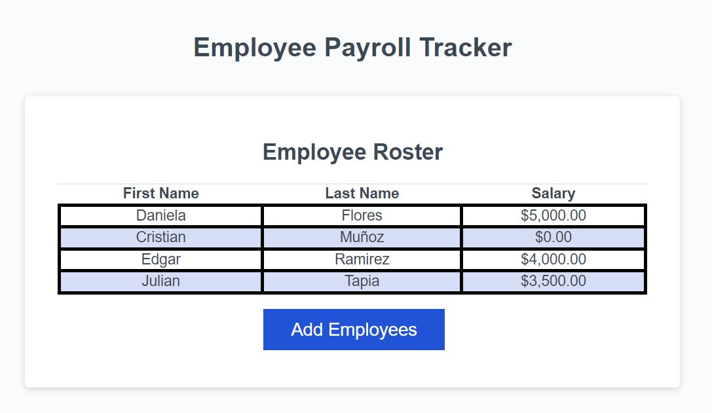

# DIGG-Module3-Challenge-JS-PayrollTracker
Dalia Gomez - Module 3 Challenge: JavaScript, Employee Payroll Tracker

## Description
The purpose of this challenge was to modify the source code for an application that a payroll manager will use to view and manage employee payroll data. The "DIGG-Module3-Challenge-JS-PayrollTracker" repository includes a CSS file, an HTML file, a JavaScript file, a .gitignore file, a license file and this README file.

## Links
- URL of the GitHub repository that contains the code: https://github.com/dali-gogo/DIGG-Module3-Challenge-JS-PayrollTracker 
- URL of the deployed application: dali-gogo.github.io/DIGG-Module3-Challenge-JS-PayrollTracker  

## Usage
After clicking the "add employees" button, the website will request the user to enter the employee's first name, then his/her last name and finally, his/her salary. After completing these fields, it will request the user whether he/she wants to add a new record (information about a new employee). If the user chooses to continue, the first name, last name and salary of the next employee will be requested. If the user chooses to stop (cancel), the website will deploy the table (sorted in alphabetical order), with the data from the employees. 

In the console, the user will be able to see the average salary of the employee, and the name of a random employee, considered to be the random winner of a raffle.

## Credits
The starter code used was pulled from Boot Camp Spot, Bootcamp Code TDM-VIRT-FSF-PT-03-2024-U-LOLC-MTTH. Modifications to the source code were performed by Dalia Gómez to meet the acceptance criteria defined for the challenge.

## License
MIT License used for the corresponding repository.

## Screenshots

